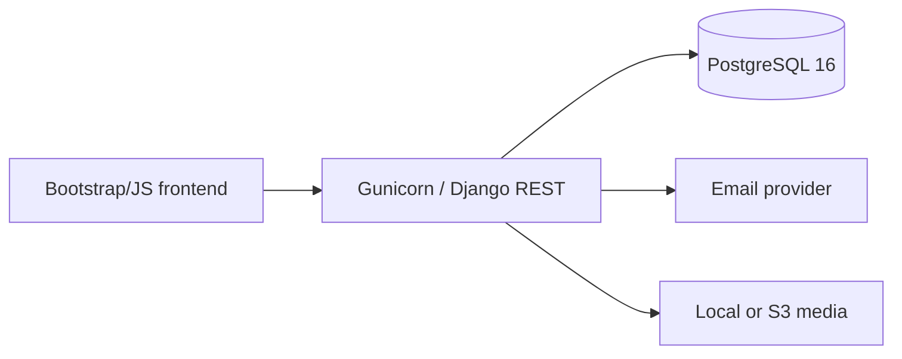

# System architecture

The system is a Django REST API served directly by Gunicorn. PostgreSQL is the source of truth and Django's local-memory backend handles short-lived response caching and throttling for this single-web-container deployment. Email notifications run synchronously. JWT access tokens authenticate staff. Public reads expose only published records; anonymous form writes use throttling, honeypots, duplicate fingerprints, and server-side validation.

Domain code is split by business ownership. `common` owns cross-cutting UUID, audit, soft-delete, validation, rendering, pagination, and permissions. Views orchestrate HTTP only; reusable mutations belong in services and optimized reads in selectors as rules grow.

## Security boundary

A production load balancer should terminate TLS before Gunicorn. Django trusts only the configured proxy header, uses an explicit host/CORS allowlist, secure cookies, HSTS, MIME/extension/size validation, ORM parameterization, JWT refresh rotation and blacklisting. Audit events deliberately omit request bodies and credentials.

## Implementation phases

1. Platform, accounts, response contract, health, audit, deployment.
2. Projects, location hierarchy, amenities, inventory, gallery, progress.
3. Homepage CMS, team, testimonials, blogs, SEO.
4. Careers, inquiries, meetings, landowner proposals, newsletter.
5. Media optimization/S3, CAPTCHA provider, transactional email templates.
6. Load/security testing, observability, backup rehearsal, production launch.
