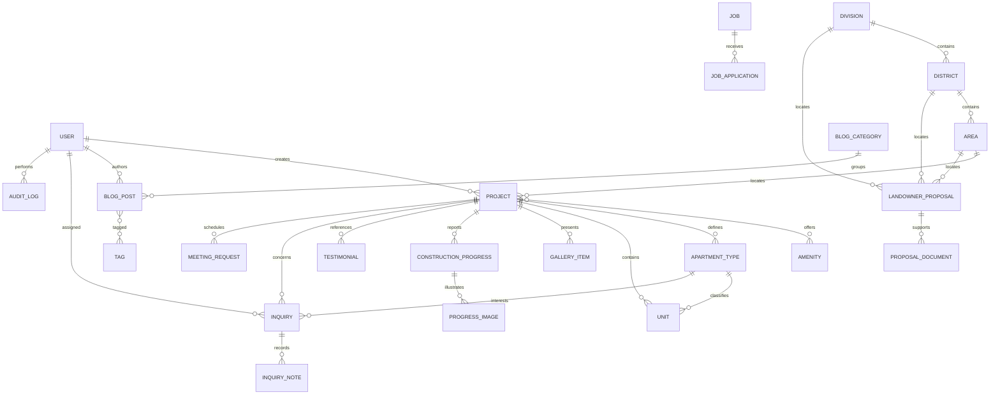

# Database ERD

Location foreign keys preserve canonical geography. Project-to-amenity is many-to-many so amenities are reusable. Inventory is tied to both its project and apartment type, with a database uniqueness rule across project/building/floor/unit. Deleting a project is soft; dependent media and inventory are protected from accidental disappearance through that boundary. Submission records retain nullable project/user references so historical leads survive staff or catalog changes. Supporting files are child rows, enabling multiple uploads without repeating proposal data.
